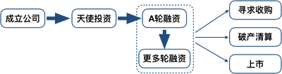
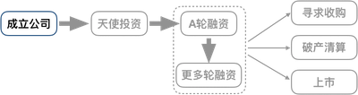
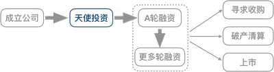
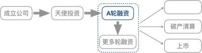
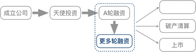
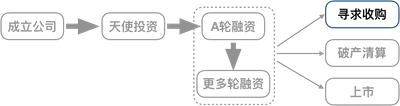
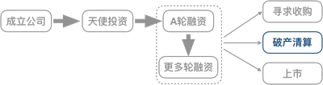
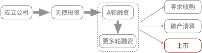

最近几个创业的朋友和我聊到融资话题，虽然我也没创过业，不过最近学习的课程里刚好涉及一些融资内容，我把几门课程的融资部分提取出来，整理成笔记，或许以后自己也会用到。  

<!-- more -->

# 公司融资地图
下图展示了公司从成立到各轮融资，到最终或被收购、或破产清算或上市的流程图：  
  
在天使轮之前还有种子轮，是指公司只有idea却没有具体产品或服务，创业者只拥有技术上的新发明、新设想以及对未来企业的蓝图。挺起来好像不太靠谱，靠谱的案例还是有的，Airbnb获得YC2万美金的投资就是种子轮，当时Airbnb的业务还是“充气床+早餐”的形态（Airbnb的缩写就是Air bed and breakfast）。

## 成立公司  
假设：Sam和Johny开发出产品原型，申请专利，准备创办公司并约定：二人股权相等。

## 天使投资
假设Sam和Johny从Jerry拉到了融资，该轮融资称为**天使轮**：
  

如何定价呢？
Sam&Johny主张800万，而Jerry主张300万，最终协商达成一致：
1. 投资后估值500万，其中S&J的工作值450万，Jerry投资50万，占股权10%。
2. 约定：如果下次融资，投资人认定估值不足500万，需按实际估值计算Jerry的50万所占股份
3. 约定：保留10%的股权给未来的员工、重要管理层成员和顾问

显然条款2是为了保护投资人的利益，否则下轮融资如果公司估值不足500万，各方还按照股权比例估值的话，那Jerry50万的真金白银就缩水了。

本轮融资后，股权比例如下：  

股权人|股权
----|----|----
Sam|40%
Johnny|40%
Jerry|10%
预留|10%

## A轮融资
假设1年后公司经营不错，需要再次融资，该轮被称为A轮融资：
  
S&J给自己估值2000万，希望融500万，占股权20%，引入巨杉资本，双方商定：  
公司在融资前值1600万，巨杉资本出资400万，占股权20%，同时巨杉资本要求在董事会占据一席。
本轮融资后，股权比例为：  

股权人|股权|价值（万）|增值
---|----|----|----
Sam|32%|640|3.2x
Johnny|32%|640|3.2x
Jerry|8%|160|3.2x
巨杉资本|20%|400|1.0x
预留|8%|160|3.2x

S&J和Jerry的占股比例缩小了，被称为**股权稀释**，但他们的股票潜在价值增加了。假设此时公司共发行2000万股，每股1美金，于是可以计算出上表各股权人的股权价值。

## 更多轮融资
假设1年后公司经营不错，有了1年500万的收入，虽然不盈利，但很有希望。
S&J和Jerry、巨杉资本商量，认为当前估值9000万，需要再融1000万。该轮就成为B轮，之后的称为C、D……轮融资：  
  

但由于整体经济放缓，引入的白石风头，与之协商达成一致：
1. 投资前公司估值6000万，白石投资900万。
2. 公司重点从技术开发转向市场推广，白石要求公司引入一个有市场推广经验的职业经理人做CEO。
3. 为了让CEO有归属感，需**增发**股票给新来的CEO，再增发一些**受限制的股份**给包括S&J在内的全体员工。

此后股权结构为：

股权人|股权|价值（万）|增值
---|----|----|----
Sam|25.6%|1920|9.6x
Johnny|25.6%|1920|9.6x
Jerry|6.4%|480|9.6x
巨杉资本|16%|1200|3.0x
白石风投|12%|900|1x
预留|6.4%|480|9.6x
未来CEO和员工奖励|8%|600|1x

假定公司股票**一拆三**，拆分后依然是每股1美金，此时公司共发行7500万股的股票，给未来CEO和奖励员工的股票各300万。

## 寻求收购
如果公司长期无法盈利，则有两种选择：1、引入更多轮融资，但融后的情况谁也说不准；2、寻求收购  
    
假设寻求到了某大腿以8000万的价格收购，怎么分钱呢？  
简单计算：8000万/7500万股=1.07元/股  
根据上面的股权结构图很容易看出：这种分法对早期创始人、投资人有利，后来的投资人白石只有7%的收益。因此，通常白石在投资时会加入条款：**当被收购时，至少保证一定的利润如50%。**巨杉和Jerry可能也会有同样的要求，这样创始人和员工就会少分一些钱，甚至分不到钱。

## 破产清算
更坏的情况是公司一直亏损，找不到收购方，投资人不会坐视不管，会要求其破产清算，清算方案通常会写入每笔投资引入时的协议中。  
    
假定公司有500万资产，按照占股比例：
白石:巨杉资本:Jerry=900:1200:480，他们分别得到180万、240万和80万
此时创始人是分不到钱的。

## 上市
最好的情况是经过几年的经营，公司上市，假设承销商给他们估值3亿。  
    
按照上市价格，当然还要扣除掉操作上市的费用  
S&J的股票价值约6000万；Jerry的股票价值150万，获得了30倍的回报；巨杉资本获得了10倍的回报；白石资本获得了3倍的回报。  
在硅谷，获得融资的公司只有1%能上市，这已经是全球比例最高的了。早期投资回报通常是50倍，这样的回报被称为**本垒打**。  

结论：
1. 对于没有上市的公司，不管估值多高，创始人的财富都仅停留在纸上，只有落袋为安后才是自己的。
2. 投资人和创始人利益是一致的，除非到了关门清算的时候。
2. 投资人的股份在清算时有优先权，被称为**优先股**，至于怎么清算，要看协议。一般早期投资人能拿到大部分投资，后期可能会亏损，甚至也会出现上市的价格依然比最后一轮融资低的情况。
4. 公司最终要靠盈利获得财富，靠烧投资人的钱，早晚有一天资金链断裂，当初纸面上的财富也就打水漂了。

# 融资的要点
融资特别像找工作，只不过找工作是向企业展示个人的优点，希望被雇佣；而融资则是向投资人展示公司的优点，希望被投资。

## 尽量缩短“融资模式”的时长
创业公司早期的增长主要依靠创始人带动，一旦创始人心思被拉到了别的地方，公司的增长就很容易出问题，这又会促使投资人更加犹豫要不要投资。因此，要么进入“融资模式”，全力解决融资问题，要么干脆不要想。Paul Graham说过一句经典的话：“融资最重要的目的不是证明你的公司有多好多值钱，而是赶快结束这个过程，拿到钱后赶紧回去干活。”

## 营造集中的竞争环境
这与前一条其实是同一个动作的内外两面考虑。把所有融资安排在相对集中的时间段里，尽快获得第一个term sheet，这样会占据主动权。因为其他人不跟进，你可以接受这个term sheet，如果其他人跟进，你就可以在价格和条款方面有了谈判空间。

## 划定融资人范围和优先级
Paul Graham说：“最常见到的创业者融资犯的一个错误就是对投资人的优先级和见面顺序没有任何规划，赶上谁就见谁。这样是非常不利于自己融资的。”好的融资流程应该是：先拿一些没那么想去的投资人练练手，获得一些经验，再去面那些难度高的投资人。当然也不要把最心仪的投资人放到最后，创业圈和投资圈很小，如果你一直在外融资，万一结果又不是很好，信息很容易扩散到这个圈子。

## 白纸黑字的投资协议才算数
还是Paul Graham说的：“只要投资人说的不是Yes，然后白纸黑字的写下来，你都当成No就行了。”这未必是因为投资人诚信有问题，而是一方面投资很多时候是集体决策，你见的单个投资人也许没法自己拍板；另一方面融资和创业环境瞬息万变，也许一两周之后环境或局势发生变化了，投资人需要根据环境调整决策。

## 别太在意估值
还是Paul Graham的话：“最好别拿给你估值最高的那家投资机构的钱。”因为一、最好的投资人对你选择他们是有信心的，而且也知道自己对于创业者的价值所在，因此不会乱报价；二、报价过高会在未来融资轮中把自己高高架起，不利于后面的融资。

## 礼貌对待拒绝过你的人
熊太行老师在关系攻略里说过：“做人留一线，日后好相见。”要礼貌对待拒绝过你的人，投资人也会犯错误，而且优秀的投资人是非常愿意改正自己的错误的，要给自己流出余地。

## 尽早获得第一个term sheet
term sheet可以理解为求职时获得的offer，有没有拿到第一个term sheet，融资状态会是完全不同的。

# 参考文献
1. 《吴军谷歌方法论》第52封、53封来信
2. 《张潇雨经典商业案例》
3. [《Paul Graham：写了一万六千字告诉你，如何融资》](https://36kr.com/p/5038768.html)