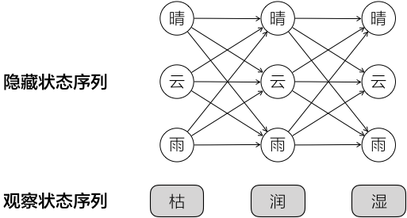
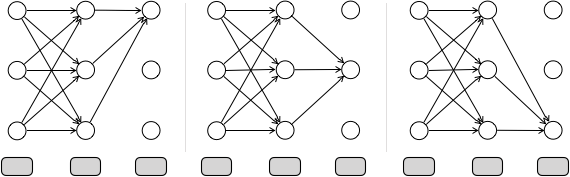
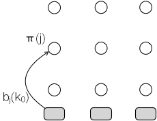
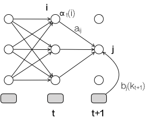
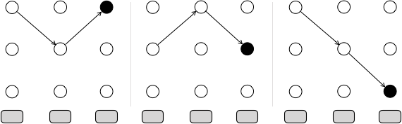
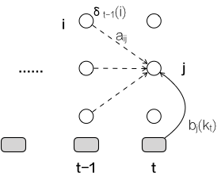
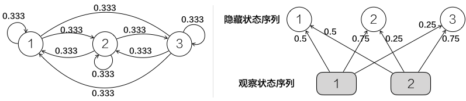
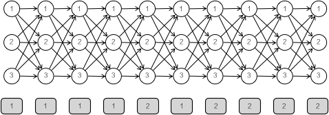

隐马尔科夫模型对于输入法音字转换太重要了，这个周末花点时间把相关算法吃透。

<!-- more -->

# HMM模型定义
假设
$Q = \{q_1, q_2, ..., q_N\}$      是所有可能的隐藏状态的集合
$V = \{v_1, v_2, ..., v_M\}$      是所有可能的观测状态的集合
令长度为T的序列
I = ${i_1, i_2, ..., i_T}$, 其中$i_t∈Q$      为状态序列
O = ${o_1, o_2, ..., o_T}$ , 其中$o_t∈V$     为观察序列

HMM模型有两个假设：
1. 齐次马尔科夫链假设。
如果在`t`时刻的隐藏状态是 $i_t=q_i$，在时刻`t+1`的隐藏状态是 $i_{t+1} = q_j$，则从时刻`t`到时刻`t+1`的HMM状态转移概率$a_{ij}$可以表示为：
$a_{ij} = P(i_{t+1} = q_j | i_t=q_i)$

    $a_{ij}$组成马尔科夫链的状态转移矩阵：$A = [a_{ij}]_{N×N}$

2. 观测独立性假设。任意时刻的观察状态仅依赖于当前时刻的隐藏状态。
如果在时刻`t`的隐藏状态是$i_t=q_j$，而对应的观察状态为$o_t = v_k$，则该时刻观察状态$v_k$在隐藏状态$q_j$下生成的概率$b_j(k)$满足：
$b_j(k) = P(o_t = v_k | i_t = q_j)$

    这样$b_j(k)$组成观测状态生成的概率矩阵：$B = [b_j(k)]_{N×M}$， 也称为发射矩阵。

需要一组在`t = 1`的隐藏状态概率分布
$\Pi = [π(i)]_N， 其中π(i) = P(i_1=q_1)$

一个HMM模型由三元组$λ = (A, B, \Pi) $表示。

# HMM的应用
HMM可以解决三类问题：
1. 评估（Evalution）给定HMM求一个观察序列的概率。使用前向算法forward algorithm
2. 解码（Decoding）搜索最有可能生成一个观察序列的隐藏状态序列。使用维特比算法viterbi algorithm
3. 学习（Learning）给定观察序列生成一个HMM。使用前向-后向算法forward-backward algorithm

后面的例子都是基于下面的故事背景完成的。假设天气有晴、云、雨三种状态，但是不可直接观测，必须通过海藻的枯、干、润、湿四种状态来推测。因此：  
Q = {晴, 云, 雨}			为隐藏状态集合
V = {枯、干、润、湿}	为观测状态集合

令转移矩阵A为：$\left\lgroup \matrix{\; & &  & 今天 &  \cr \; & & 晴 & 云 & 雨 \cr 昨天 & 晴 & 0.5 & 0.375 & 0.125 \cr & 云 & 0.25 & 0.125 & 0.625 \cr & 雨 & 0.25 & 0.375 & 0.375 } \right \rgroup$ $\;$   

发射矩阵B为：$\left\lgroup \matrix{ & & & 观测到海藻状态  \cr \; & & 枯 & 干 & 润 & 湿 \cr 隐藏的天气状态 & 晴 & 0.60 & 0.20 & 0.15 & 0.05 \cr & 云 & 0.25 & 0.25 & 0.25 & 0.25 \cr & 雨 & 0.05 & 0.10 & 0.35 & 0.50 } \right \rgroup$ $\;$   

初始向量$\Pi$为：$\left\lgroup \matrix{晴 & 云 & 雨 \cr 1.0 & 0.0 & 0.0} \right \rgroup$ $\;$  

# 前向算法解决评估问题
给定HMM模型，求某个观察序列的概率。以天气为例，求连续3天观察海藻状态为(枯、润、湿)的概率。
## 方案一：穷举

`Pr(枯,润,湿 | HMM) = Pr(枯,润,湿 | 晴,晴,晴) + Pr(枯,润,湿 | 晴,晴,云) + Pr(枯,润,湿 | 晴,晴,雨) + …… + Pr(枯,润,湿 | 雨,雨,雨)`  
连续三个晴天的概率可由初始向量、转移矩阵查得，由晴到枯、润、湿的概率可由发射矩阵查得，因此可以计算  
`Pr(枯, 润, 湿 | 晴, 晴, 晴)`
同理可以计算等号右侧每一个加数表达式的值。
它的时间复杂度为：$2TN^T$，因为加数式的个数共有$N^T$个，每个加数式中要计算T次转移概率和T次发射概率。

## 方案二：递归
定义局部概率（partial probability）：到达某个中间隐藏状态时的概率。于是在t时刻位于状态j的局部概率为：  
$α_t(j) = Pr(观察状态 | 隐藏状态) × Pr(t时刻所有指向状态j的路径)$

于是只需要把最后的观察状态对应所有隐藏状态的局部概率加和即可。

当t=0时，$α_0(j) = π(j)·b_j(k_0) $
其中：  
π(j)为初始概率  
$b_j(k) = P(o_t=v_k | i_t=q_j)$


--------

于是 $α_{t+1}(j) = b_j(k_{t+1}) · \sum_{i=1}^n α_t(j)a_{ij}$  
其中  
$a_{ij} = P(i_{t+1} = q_j | i_t=q_i)$


-----------

于是对于指定的观察序列： $Y(k) = y(k_1), ..., y(k_T)$
得到该序列的概率为： $Pr(Y(k)) = \sum_{j=1}^nα_T(j)$

它的时间复杂度为$N^{2T}$。因为在T+1时刻，每一个j点的复杂度为N，T+1对应所有隐藏状态的复杂度为$N^2$，共有T个时间序列，因此为${(N^2)^T}$。

# 维特比算法解决解码问题
对于给定HMM和一个观察序列，求生成该序列最可能的隐藏状态序列。还以天气故事为例，求生成枯、润、湿最可能的天气序列。

## 方案一：穷举
Pr(观察序列 | 各种隐藏状态的组合) = Pr(枯,润,湿 | 晴,晴,晴) + Pr(枯,润,湿 | 晴,晴,云) + Pr(枯,润,湿 | 晴,晴,雨) + …… + Pr(枯,润,湿 | 雨,雨,雨)

该方案和[前向算法的穷举](/2018/12/16/2018/1216HMM/#%E6%96%B9%E6%A1%88%E4%B8%80%EF%BC%9A%E7%A9%B7%E4%B8%BE)完全一致。

## 方案二：递归
在网格中每一个中间状态，都有一个到达该状态最可能的路径。如下图所示：
  
称这些路径为`局部最佳路径`。每一个局部最佳路径都有一个相关联的概率，称为`局部概率δ`。与前向算法中的局部概率不同，δ是到达该状态最佳路径的概率。  
$\delta_t(i)$是t时刻到达状态i所有序列概率中最大的概率。当t=T时，每个隐藏状态都有一个局部概率和局部最佳路径，通过比较，即可得出最大局部概率的状态及相应路径，也就得出了全局最佳路径。

当t=0时，$\delta_0(i)=π(i)·b_i(k_0)$
这与前向算法一致  


--------

于是，在t+1时刻到达状态j的最佳路径，可以通过比较所有到达j的前序节点最佳路径运算而得：  
$\delta_{t}(j) = \underset{i}{max}[\delta_{t-1}(i)·a_{ij}·b_j(k_t)]$  
  
令$\Phi_t(j) = \underset{i}{ArgMax}(\delta_{t-1}(i) · a_{ij} )$，其中$\underset{i}{ArgMax}(...)$表示获得括号中最大的值的那个i。  
于是$\Phi_t(j)$就记录了在时刻t到达j的最佳路径，注意$\Phi_t(j)$中不包含$b_j(k_t)$因子，因为他要比较到达j的最佳路径，没必要给每条路径都乘以该常数。

## 实现版本
[Tapas Kanungo's Software Page](http://www.kanungo.com/software/software.html)中的UMDHMM有一份维特比算法的实现，但是包含了一些不必要的中间文件，我稍作清理把它上传到自己的Github上：[UMDHMM](https://github.com/palanceli/UMDHMM)，并添加了一个CMakeLists.txt。  
其中UMDHMM/*.hmm文件记录了hmm模型参数：
```
# test.hmm
M= 2                # 观察状态个数
N= 3                # 隐藏状态个数
A:                  # 转移矩阵
0.333 0.333 0.333
0.333 0.333 0.333
0.333 0.333 0.333
B:                  # 发射矩阵
0.5   0.5  
0.75  0.25
0.25  0.75
pi:                 # 初始向量
0.333 0.333 0.333
```
  
UMDHMM/*.seq文件记录了
```
# test.seq
T= 10               # 时间间隔个数
1 1 1 1 2 1 2 2 2 2 # 观察状态序列
```
  
运行结果如下：
```
------------------------------------
Viterbi using direct probabilities
Viterbi  MLE log prob = -1.387295E+01
Optimal state sequence:
T= 10
2 2 2 2 3 2 3 3 3 3 
------------------------------------
Viterbi using log probabilities
Viterbi  MLE log prob = -1.387295E+01
Optimal state sequence:
T= 10
2 2 2 2 3 2 3 3 3 3 
------------------------------------
The two log probabilites and optimal state sequences
should identical (within numerical precision). 
Program ended with exit code: 0
```

# 参考资料
[隐马尔可夫模型HMM](https://zhuanlan.zhihu.com/p/29938926)  
[HMM学习最佳范例四：隐马尔科夫模型](http://www.52nlp.cn/hmm-learn-best-practices-four-hidden-markov-models)  
[HMM学习最佳范例五：前向算法\[1\]](http://www.52nlp.cn/hmm-learn-best-practices-five-forward-algorithm-1)  
HMM学习最佳范例六：维特比算法[\[1\]](http://www.52nlp.cn/hmm-learn-best-practices-six-viterbi-algorithm-1) [\[2\]](http://www.52nlp.cn/hmm-learn-best-practices-six-viterbi-algorithm-2) [\[3\]](http://www.52nlp.cn/hmm-learn-best-practices-six-viterbi-algorithm-3) [\[5\]](http://www.52nlp.cn/hmm-learn-best-practices-six-viterbi-algorithm-5)  
吴军. 数学之美[M]. 北京：人民邮电出版社，2012：49-58.  
