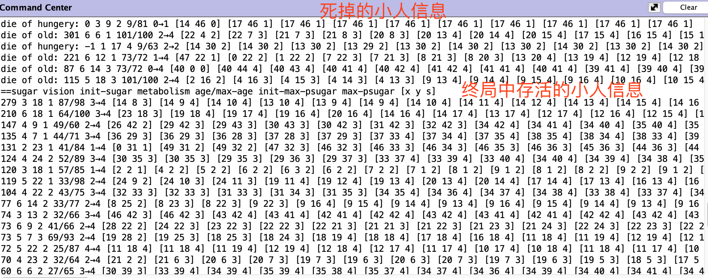

幂律分布和正态分布是现实生活中存在的两种现象，比如人的身高、体重、体能、智商呈正态分布，而财富分配却呈现出幂律分布的特征，这是个挺值得思考的课题。也就是说在初始条件大家天生资质相差不大的情况下，经过充分竞争，却演化出了阶层，且贫富差距悬殊。Sugarscape实验通过建立模型演示了该结果的形成过程，希望通过对实验的深入研究，对于个人职业规划和公司战略制定得出一些启发性的思考。

<!-- more -->
# Netlogo
NetLogo 是一个用来对自然和社会现象进行仿真的可编程建模环境。它是由 Uri Wilensky教授 在1999 年发起，由美国西北大学的“连通学习和计算机模拟中心(CCL)”负责持续开发。 CCL是由Uri Wilensky教授领导的研究小组。

NetLogo下载地址：http://ccl.northwestern.edu/netlogo/download.shtml

它包含了很多实验模型，其中[Sugarscape 3 财富分配模型](http://ccl.northwestern.edu/netlogo/models/Sugarscape3WealthDistribution)，模拟了人类社会财富分配的演进过程。

# Sugarscape财富分配模型
[Sugarscape 3](http://ccl.northwestern.edu/netlogo/models/Sugarscape3WealthDistribution)讲了这样一个故事：给定一张地图被分割成N×N的小块，每个小块会不断长出糖份，小块能容纳的糖份上限是固定的且各不相同。每过一个时钟滴答，地图上每个小块会增加一个单元的糖份，直到达到上限。每个小块包含的糖份含量通过其颜色体现出来，黄色越深，含糖量越高。

在地图上随机分布一些小人，每个小人只能看到附近几个小块，具体能看到几个是在小人出生时随机生成的。每个时钟滴答下每个小人可以向视野内糖份最高且未被占领的小块移动一格，并且获取他所占领的小块上的糖份。

每个时钟滴答，小人都会因为代谢损失一些糖份，糖份耗尽，小人就会死掉。每个小人的代谢率不同，即每个时钟滴答损失的糖份量是在小人出生时设定的。  
每个小人在出生时会被随机设定60~100个时钟滴答的寿命，当寿命耗尽，小人也会死掉。

每当一个小人死掉，系统就会在地图上随机产生一个新的小人，以保持地图上人口恒定。

## 启动Sugarscape
启动`NetLogo 6.0.4/NetLogo 6.0.4.app`，点击菜单`File - Modules Library`选择`Sample Modules - Social Science - Sugarscape - Sugarscape 3 Wealth Distribution`，如下图：  
 
点击`setup`将初始化地图和小人，点击`go`将启动游戏。  

## Sugarscape参数设定
`initial-population`：地图上一共几个小人。  
`minimum-sugar-endowment`和`maximum-sugar-endowment`：每个小人出生时可继承的糖份区间，当小人出生时会从该区间内随机取值。  
`visualization`可以根据小人的能力设置不同的绘制效果。  
 `color-agents-by-vision`：视野越大的小人，颜色越深；   
 `color-agent-by-metabolism`：代谢越慢的小人，颜色越深。  

## Sugarscape数据呈现
- `Wealth distribution`柱状图表征财富分配状态。横轴表示财富数，纵轴表示人数。  

- `Lorenz curve`显示百分之多少的人占有百分之多少的糖。这是一条洛伦兹曲线，横轴表示人口占比，纵轴表示财富占比。黑色对角线表示财富均匀分布的参考线，红线表示实际分布，越往右下角凹陷，表示财富分布越不均匀。

- `Gini index vs. time`显示随时间变化，糖分布的均匀程度，其中0表示所有的每个人都占有相同的糖，1表示只有1个人占有了所有糖，其余的人没糖吃。

# Sugarscape实验
这个模型像极了现实世界的资源分配和竞争过程：小人们出生时，有的天生视力好，有的天生体力好（代谢率低），有的天生富二代（出生时携带的糖份），这些特征是随机分布的。点击`go`后，让他们充分竞争……

## 实验一
设置400个小人，代谢区间在[5, 25]，出生时的初始化糖份也在这个区间。根据右上角的财富分布图可见，初始财富基本符合正态分布：  
  
执行大约100步后，财富开始呈现出明显的幂律分布：  

之后又让它跑了2000步，基本上维持在这个水平：   

跑了十几轮始终是这个结果。  

这400个小人，有的天生视力好，有的天生体力好（代谢率低），有的天生富二代（生出来携带的糖份高），这些特征是随机分配且符合正态分布。让他们在一个封闭区域内充分竞争，最终的资源分配总是呈现出幂律分布的特征，也就是说阶层分化是充分竞争的必然结果。  
那么，现实世界中充分竞争的，除了财富，还有各种机会、职位、各种社会资源。也就是说大同世界只是一个美好的幻境，阶层分化，而且头部效应越来越严重才是现实。

## 实验二
那么最终的赢家，他们具备什么特质，有什么共性吗？可以在态势稳定后，根据财富排行榜，把小人的各项指标打印出来。这还需要再做点工作：

- 给turtles增加两个字段，记录出生时携带的糖份以及出生地的糖份。每个turtle就是一个活动个体，在这个实验中就表示一个糖人，下面这段代码声明了糖人的私有数据：
```
turtles-own [
  init-sugar      ;; 记录出生时携带的糖份
  init-psugar     ;; 记录出生地的糖份
  sugar           ;; the amount of sugar this turtle has
  ...
  natural causes
]
```

- 修改初始化代码，先初始化地图，再初始化小人。
原先的代码是先执行`create-turtles initial-population [ turtle-setup ]`再执行`setup-patches`，需要把这两行对调一下：
```
to setup
  ...
  setup-patches
  create-turtles initial-population [ turtle-setup ]
  update-lorenz-and-gini
  reset-ticks
end
```

- 在初始化turtle时，记录出生时继承的糖份和出生地糖份。
```
to turtle-setup ;; turtle procedure
  ...
  move-to one-of patches with [not any? other turtles-here]
  set sugar random-in-range minimum-sugar-endowment maximum-sugar-endowment
  set init-sugar sugar          ;; 记录出生时继承的糖份
  set init-x xcor
  set init-y ycor
  set init-psugar psugar        ;; 记录出生地的糖份
  ...
  run visualization
end
```
- 在竞争态势稳定后，打印每个糖人的各字段：
```
type sugar type " " type vision type " " type init-sugar type " " type init-psugar type " " print metabolism
```
