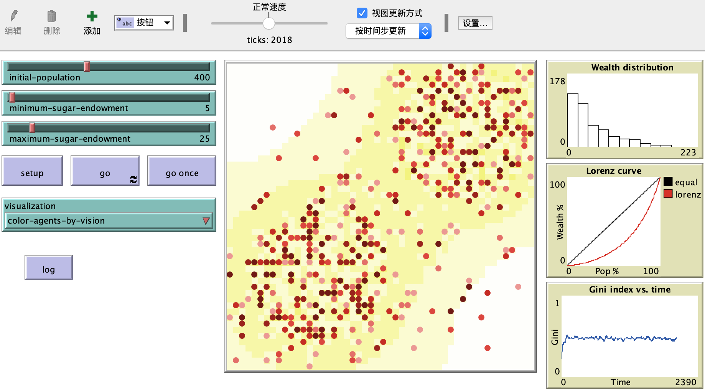

幂律分布和正态分布是现实生活中存在的两种现象，比如人的身高、体重、体能、智商呈正态分布，而财富分配却呈现出幂律分布的特征，这是个挺值得思考的课题。也就是说在初始条件大家天生资质相差不大的情况下，经过充分竞争，却演化出了阶层，且贫富差距悬殊。Sugarscape实验通过建立模型演示了该结果的形成过程，希望通过对实验的深入研究，对于个人职业规划和公司战略制定得出一些启发性的思考。

<!-- more -->
> 越深入研究这个实验，越发现是个挺大的课题，有篇文章叫做[《大糖帝国》](https://www.zhihu.com/search?type=content&q=%E5%A4%A7%E7%B3%96%E5%B8%9D%E5%9B%BD)专门阐述这个实验，并把讨论延伸到了社会现象，但无论是文章本身还是回复，大多从社会学感性的角度来评论，说明两极分化无可避免，并没有定量分析到底是什么因素造成了这个实验两极分化的终局。而且当我不断变换各种参数，把终局中top的“穷人”和“富人”各个指标打印出来，不断被一些颠覆性的现象毁三观。我发现没那么容易得出结论。

> 这个实验被引用得很多，但大部分文章在阐述了实验结果之后，直接给出结论，比如：“决定穷人富人的因素是：天赋、出身、运气、选择”，我觉得这个结论站不住脚。首先这个实验仅引入这几个因素，是否够充分，无法得到证明。其次，实验现象仅表明充分竞争后出现了两极分化，至于什么因素导致分化必须要观测终局中“穷人”和“富人”的特征，是否这些因素都起了作用，或者仅某几个因素起作用了，即必要性这一点也没有证明。不过实验现象确实足够震撼，几个简单的规则充分演化后就能出现阶层分化，无论怎么设定初始参数都是如此，真的好神奇！所以很多文章第一次读完，被实验现象震撼之余很容易被接下来逻辑不严密的“结论”征服。

我猜测大部分人没有亲手做过这个实验，因为NetLogo有自己一套偏僻的语法，想深入研究必须要自己动手修改模型，让实验输出更多数据。周末被强烈的好奇心驱使，学习了这套语法，把我的实验和分析过程记录下来。代码放到了[https://github.com/palanceli/NetLogo/blob/master/Sugarscape%203%20Wealth%20Distribution.nlogo](https://github.com/palanceli/NetLogo/blob/master/Sugarscape%203%20Wealth%20Distribution.nlogo)。

# NetLogo简介
[NetLogo](http://ccl.northwestern.edu/netlogo/) 是一个用来对自然和社会现象进行仿真的可编程建模环境。它是由[Uri Wilensky](http://ccl.northwestern.edu/Uri.shtml)教授 在1999 年发起，由美国西北大学的[连通学习和计算机模拟中心(CCL)](http://ccl.northwestern.edu/)负责持续开发。 CCL是由Uri Wilensky教授领导的研究小组。

NetLogo下载地址：http://ccl.northwestern.edu/netlogo/download.shtml

它包含了很多实验模型，其中[Sugarscape 3 财富分配模型](http://ccl.northwestern.edu/netlogo/models/Sugarscape3WealthDistribution)，模拟了人类社会财富分配的演进过程。

# Sugarscape财富分配模型
[Sugarscape 3](http://ccl.northwestern.edu/netlogo/models/Sugarscape3WealthDistribution)讲了这样一个故事：给定一张地图被分割成N×N的方格，每个方格会不断长出糖份，方格能容纳的糖份上限是固定的且各不相同。每过一个时钟滴答，地图上每个方格会增加一个单元的糖份，直到达到自己的上限。每个方格包含的糖份含量通过其颜色体现出来，黄色越深，含糖量越高。

在地图上随机分布一些小人，每个小人只能看到附近几个方格，具体能看到几个是在小人出生时随机生成的。每个时钟滴答小人可以移到视野内糖份最高且未被占领的方格，并且获取该方格上的糖份。

每个时钟滴答，小人都会因为代谢损失一些糖份，糖份耗尽，小人就会死掉。每个小人的代谢率不同，即每个时钟滴答损失的糖份量是在小人出生时设定的。每个小人在出生时会被随机设定60~100个时钟滴答的寿命，当寿命耗尽，小人也会死掉。每当一个小人死掉，系统就会在地图上随机产生一个新的小人，以保持地图上人口恒定。

## 启动Sugarscape
启动`NetLogo 6.0.4/NetLogo 6.0.4.app`，点击菜单`File - Modules Library`选择`Sample Modules - Social Science - Sugarscape - Sugarscape 3 Wealth Distribution`，载入模型。也可以下载[我的Sugarscape版本](https://github.com/palanceli/NetLogo/blob/master/Sugarscape%203%20Wealth%20Distribution.nlogo)，点击`File - Open`载入该文件。如下图：  
 

点击`setup`将初始化地图和小人，点击`go`将启动游戏。  

## Sugarscape参数设定
`initial-population`：地图上一共几个小人。  
`minimum-sugar-endowment`和`maximum-sugar-endowment`：每个小人出生时可继承的糖份区间，当小人出生时会从该区间内随机取值。  
`visualization`可以根据小人的能力设置不同的绘制效果：`color-agents-by-vision`：视野越大的小人，颜色越深；`color-agent-by-metabolism`：代谢越慢的小人，颜色越深。  

## Sugarscape数据呈现
- `Wealth distribution`柱状图表征财富分配状态。横轴表示财富数，纵轴表示人数。即右侧柱子高度表示富人个数，左侧表示穷人个数。  

- `Lorenz curve`显示百分之多少的人占有百分之多少的糖。这是一条洛伦兹曲线，横轴表示人口占比，纵轴表示财富占比。黑色对角线表示财富均匀分布的参考线，红线表示实际分布，越往右下角凹陷，表示财富分布越不均匀。

- `Gini index vs. time`显示随时间变化，糖分布的均匀程度，其中0表示所有的每个人都占有相同的糖，1表示只有1个人占有了所有糖，其余的人没糖吃。

# Sugarscape实验
这个模型像极了现实世界的资源分配和竞争过程：小人们出生时，有的天生够努力（单位时间走得远），有的天生体力好（代谢率低），有的天生富二代（出生时携带的糖份），有的天生站位好（生在富糖的格子上），这些特征是随机分布的。点击`go`后，让他们充分竞争……

## 实验一
设置400个小人，代谢区间在[5, 25]，出生时的初始化糖份也在这个区间。根据右上角的财富分布图可见，初始财富基本符合正态分布：  
  
执行大约100步后，财富开始呈现出明显的幂律分布：  

之后又让它跑了2000步，基本上维持在这个水平：   

跑了十几轮始终是这个结果。  

这就是大部分文章阐述的现象，天生资质符合正态分布的群起在一个封闭区域内充分竞争，最终的资源分配总是呈现出幂律分布的特征，也就是说两极分化是充分竞争的必然结果。  
在现实世界中充分竞争的，除了财富，还有各种机会、职位、各种社会资源。也就是说大同世界只是一个美好的幻境，阶层分化，而且头部效应越来越严重才是现实。

## 实验二
那么最终的赢家，他们具备什么特质，有什么共性吗？可以在态势稳定后，根据财富排行榜，把小人的各项指标打印出来。这还需要再做点工作：

- 给turtles增加一些字段，记录出生时的初始化信息。在代码中turtle表示小人，下面这段代码声明了小人的私有数据：
```
turtles-own [
  init-sugar      ;; 记录出生时携带的糖份
  init-psugar     ;; 记录出生地的糖份
  sugar           ;; the amount of sugar this turtle has
  ...
  natural causes
]
```

- 修改初始化代码，先初始化地图，再初始化小人。
原先的代码是先执行`create-turtles initial-population [ turtle-setup ]`再执行`setup-patches`，需要把这两行对调一下，因为只有这样才能在初始化小人时获得他所在方格的糖份及上限值：
```
to setup
  ...
  setup-patches   ;; 初始化地图
  create-turtles initial-population [ turtle-setup ]  ;; 初始化小人
  ...
end
```

- 在初始化turtle时，保存出生时的初始化数据：
```
to turtle-setup ;; turtle procedure
  ...
  set init-sugar sugar                   ;; 记录出生时继承的财富
  set init-max-psugar max-psugar         ;; 记录出生地有多富庶
  ...
  run visualization
end
```
- 在竞争态势稳定后，打印每个糖人的各字段：
```
to go
  if ticks > 200 [   ;; 200步停止
    ;; 根据sugar倒排
    ;;output-print "sugar vision init-sugar metabolism age init-max-psugar max-psugar"
    set log-msg word log-msg "==sugar vision init-sugar metabolism age/max-age init-max-psugar max-psugar [x y s]\n"
    foreach sort-on [(- sugar)] turtles
    [
      the-turtle -> ask the-turtle [
        print-turtle the-turtle ""
      ]
    ]
    set log-msg word log-msg "}}\n"
    print log-msg
    stop
  ]
  ...
end
```
我会把中途死掉的小人信息，以及终局中剩余小人的信息全部打印出来，包括死于饥饿还是寿终正寝，以及死掉时或者终局时小人的财富值、视野长度、代谢率以及走过了哪些路径都打印出来：


设定初始参数如下图，共50个小人：

做了10组实验，每组均跑200步，数据如下：
```
                            第1组
名次 终局时财富	视野长度	  初始财富  代谢率  终局时年龄/寿命	出生地财富→终局地财富
1     236          6          7      1     77/81          3→4
2     138          4          12     1     50/68          2→4
3     136          3          24     2     57/80          3→4
4     132          3          15     1     39/90          3→4
5     131          5          13     1     43/95          1→4
……
46     6          3          6      1     16/88          1→1
47     4          5          13     4     29/88          2→4
48     3          6          12     4     24/80          2→4
49     3          5          13     4     54/84          3→4
50     3          1          5      3     25/82          2→3

                            第2组
1      203        6          19      1      64/91          1→4
2      191        6          24      2      85/85          1→4
3      175        4          20      2      78/98          3→4
4      159        6          24      1      48/94          2→4
5      152        3          21      1      48/92          1→4
……
46      10        2          10      1      41/89          1→1
47      10        4          15      4      52/82          3→4
48      8         4          10      4      15/74          3→3
49      3         4          6       4      86/98          3→4
50      1         4          17      3      8/95           0→1

                            第3组
1      237      4           23      1      80/93      0→4
2      232      4           19      1      75/89      3→4
3      193      4           11      1      61/81      4→4
4      172      5           22      1      51/61      3→4
5      135      3           25      1      43/67      3→4
……
46      5       4           5       4       30/100      3→4
47      5       3           5       4       28/93       4→4
48      5       6           6       4       44/60       0→4
49      3       3           12      4       3/86        0→1
50      1       1           16      4       33/93       2→4

                            第4组
1      147      6           19      2      65/80      3→4
2      144      3           24      1      42/87      3→4
3      128      5           25      1      37/68      1→4
4      99       4           6       1      33/90      2→4
5      97       2           18      1      34/63      3→4
……
46      8       4           10      4      57/96      3→3
47      7       3           19      3      21/69      1→3
48      7       6           10      4      36/76      1→4
49      5       3           9       4      40/100     3→4
50      4       3           15      4      60/62      3→4

                            第5组
1      225      6           12      1      71/96      3→4
2      207      2           5       1      68/87      4→4
3      147      6           19      1      43/98      2→4
4      141      5           18      1      41/77      3→4
5      117      5           19      1      34/77      3→4
……
46      6       2           11      4      35/90      4→4
47      6       3           11      4      29/80      3→4
48      5       4           5       3      20/69      3→3
49      3       3           16      4      27/100     0→4
50      2       3           25      3      23/85      2→2
……
```
这里只列出5组数据top5的富人和穷人，原始log我放在了：
[https://github.com/palanceli/NetLogo/blob/master/Sugarscape 3 Wealth Distribution.log](https://github.com/palanceli/NetLogo/blob/master/Sugarscape%203%20Wealth%20Distribution.log)。

可以发现富人最明显的特征居然是代谢率！所有实验中，top5的富人代谢率没有低于2的，而穷人，绝大部分是在3或4。代谢率意味着生存的成本，成本低则可以活得更久，这跟我之前理解的开源/节流，首先要开源是不一致的。其次是年龄，其实他和代谢率是比较接近的——生存成本低，又能持续积累，因此成为赢家。

而占位理论所强调的“选择”似乎并没有那么重要，它对应出生地的财富上限。终局富人的出生地不乏1、2，而终局穷人的出生地也不乏3、4者。这是为什么呢？我觉得这和代谢率以及财富上限的阈值有关：如果所有方格的财富上限为4，代谢率为4的人必须活在高产的区域，我觉得这个阈值设置过于苛刻。
<font color=red>应该尝试让所有人的代谢率取值范围再低一些，或者上调地图方格的财富上限。</font>

努力程度从平均概率上来看也是有效的，只是在每组富人区里总有不怎么努力，以及在穷人区里非常努力的人，之所以落魄都是因为太能造（代谢）了。

最后再看“富二代”，和努力程度类似，平均数上反映出“富二代”成为终局富人的概率更大一些，但各组都有逆袭的屌丝以及有钱人，家道中落。

<font color=red>未完待续，还有几个问题需要继续研究：</font>
- 在这200次时钟滴答里，还有好多死掉的小人，他们有多少富足而终，有多少穷困潦倒而死，穷死的原因是什么。
- 死掉的小人里，财富分布比例如何？寿终正寝的小人里，财富分布比例如何？
- 有没有一种无敌小人，只要将参数设置到某个阈值范围内，总能成为富人？
- 有没有一种悲催命运，只要沾上了那些特征，必死无疑？