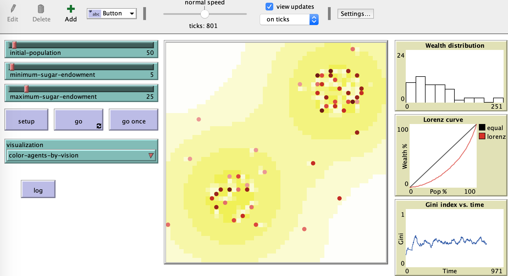

对于每一个个体，实验的本质等效于多叉树问题：根节点带一个初始分数，每一个节点表示加/减分，实验结果的分值分布就是多叉树所有叶子节点的分值。

<!-- more -->

为了简化问题，可以二叉树为例，所有的左子节点均`+1`，所有右子节点均`-1`，前者表示收入＞支出，后者没有收入只有消耗：

用图形呈现出来就明显多了：最终的财富分布特征很大程度依赖每一步加减的分数和初始携带的分数之间的差。

如果初始值为0，那么最终只有3个节点能存活，因为一旦分值小于0就死掉了，这三个节点的分值分别为`3`、`1`、`1`，确实出现了两极分化的现象：

如果把初始分值置为10，结果就不同了，所有节点都能存活，并且财富差异并不大：

这说明当物质极大丰富之后，将消除两极分化。当然这离现实远了点。然而现实生活显然也不是一天没收入就会死掉，我认为这是Sugarscape实验参数不合理之处——每天的消耗和可能获得的收入相当。

我把加数改为4，减数改为1：

如果初值为0，结果将变成纺锤形——1个`12`，2个`7`，1个`2`，饿死了4个；
如果初值为5，结果就是1个`17`，3个`12`，3个`7`，1个`2`。

回到Sugarscape实验中，我把代谢参数改为1，其它参数不变，跑800步之后结果如下：

基本上是个平均分布。

把代谢参数改为2，结果如下：

把代谢参数改为3，结果如下：

说明了什么结论呢？
1. 这个模型和现实社会之间还有挺大的差异，至少默认的收入和消耗值就挺不合常理，而这两个值恰恰决定了终局数据的分布形态。所以不能因为在某个参数设置下，终局符合幂率分布就认定它是现实社会的缩影，我觉得指导意义有限。
2. 实验将概率数据与时间演进相结合，让过程显得神秘。如果把概率摊平到空间上，用多叉树来呈现，顿时神秘感褪色很多吧。不过从多叉树上可以看出，要成为人生赢家还是小概率事件，最重要的是`走对每一步`。很显然，这需要你出生在富矿区，有足够长的视野，看到正确的方向，并持续沿着正确方向不断前行。如此苛刻的要求貌似就没啥指导意义了。