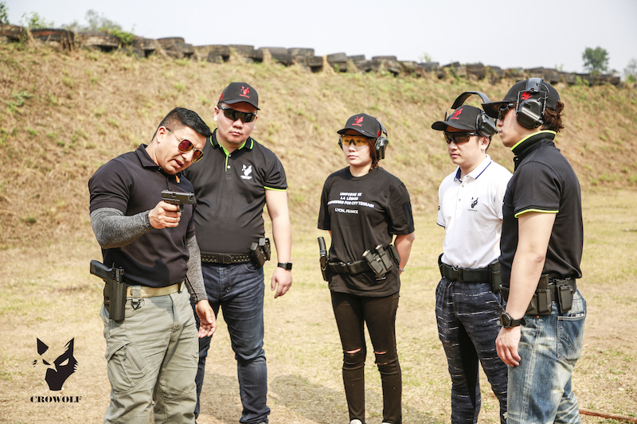

这次老挝行绝对是个意外，本以为是东南亚欢乐游，原来是场魔鬼训练。以为像是在美国有机会端各种型号的枪随意突突一阵，其实是非常严格的手枪训练。

  
<!-- more -->

# 奔赴
2月25日星期一早上6:25起飞，头天晚上只睡了4个小时。从北京到昆明要飞近4个小时，落地后先去找个地儿大吃一顿，火腿、汽锅鸡、黑三剁……美味！饭后沿着滇池溜达一圈，滇池比洱海还要大，岸边海鸥云集，完全不怕人。买了一包海鸥食洒向天空，引来无数只海鸥过来争抢。这时候千万不要抬头，被鸟粪砸中的几率很高！


# 热身
下午回酒店发装备——帽子、护目镜、耳机、腰带、枪套。全幅武装上感觉挺累赘的，第二天实弹射击后才发现都很必要。击发后弹壳飞出来的速度快，温度高，蹦出来可能会打伤眼睛或者烫伤脸，帽子和护目镜能有效起到保护作用。一天打出上百发子弹，耳朵受不了，他们配备的消音耳机太笨重了，其实可以拿国航商务舱免费发放的消音耳塞。

调好装备后，教练给我们讲了学枪的四个最基本也是最重要的原则：
- 一、永远以为每把枪里都有子弹，并且已经上膛（弹）
- 二、永远不要用枪瞄准任何你不想射击的目标（瞄）
- 三、除非准备好射击，否则手指永远不要放在扳机上（手）
- 四、射击完毕或不想继续射击时，枪支及时放入枪套（套）

缩写为：`弹瞄手套`。这四字诀是玩枪的安全要诀。  
  
晚上又是一顿胡吃海塞，第二天早上9:15从昆明出发，当地时间9:50到达老挝万象。老挝和越南在一个时区，比北京晚一个小时。上午在酒店安顿好，立刻赶往靶场。我们去的靶场叫做五四靶场。下午两点多到了靶场，先由狼影的两位组织者给我们做理论辅导。

理论辅导课由安全官负责给我们讲解。他说只要进入靶场的每个人牢记安全四诀，就能确保大家的首先是安全的。他给我们讲了IDPA的由来，接下来几天我们使用的手枪是`格洛克17`。  
  
安全官给我们演示拆枪，讲解了手枪的击发原理，还讲解了击针式手枪和击锤式手枪的差异。其实这次来学习，我的内心有点像学车，一方面觉得好玩，另一方面又非常害怕，毕竟手中之物能在分毫之间取人性命，是大杀器。学习了这些理论知识后，内心的恐惧少了几分。  

这是我们在拆装手枪  

最初压子弹时，心里还是非常恐惧的。弹夹挤压的力度非常大，最初的几颗还容易压进去，到第10颗就得非常用力了。我总是担心这么大的力，会不会把子弹挤爆了，或者一不小心击发了底火，把子弹崩了。  
  
枪弹是分离的，只有在射击前才把子弹压入弹夹，并把弹夹合入枪托，所有的子弹必须从安全官处领取。每30发子弹包在一个纸盒里，我们每次至少领取90发。最初我甚至从纸盒里把子弹倒出来，都惴惴不安的——先小心翼翼倒进手里，再一点点放入木盒子，生怕撞到哪颗子弹的屁股。老手们总是哗啦一下一股脑全倒进木盒子里，每次听到那声音，都要被惊一下，心里总要暗骂一句——你他妈不能轻点么！

安全官告诉我没听说过谁压弹夹走火的，压了几百发子弹以后，慢慢也就适应，不怎么怕了。  

# 正式训练
正式负责训练的教官是一名老挝军人，叫巴嘎斯，他不善言辞，据说平时对待学员非常严厉，很少有人见他笑过。但这次也许是团队里有女孩的原因，巴嘎斯对我们还挺和善的，我们时不时跟他开开玩笑，也会见他笑出来😆~~ 听天涛介绍巴嘎斯已经有三个孩子，如果继续服役可能随时需要上战场，考虑到要照顾家庭，终于决定退役，当一名IDPA的教官。  

两天的训练非常艰苦，跟我们本来设想的“出去玩打枪”完全不一回事。老挝的紫外线非常强，中午最高温度也在37~8°C。前一天的热身训练在棚子里进行，这两天接受巴嘎斯则是魔鬼训练，始终在太阳地儿里，捂着太阳帽和两个大耳机，练一会都能倒出水来，还要时不时跑动，两天下来身上已经晒得开始蜕皮，手指也被磨得明显粗一圈，尤其是中指的指关节，据说这是练习格洛克独有的毛病。我后来把健身用的擦汗毛巾包在脑袋上，要比遮阳帽透气一些，酷酷的~

巴嘎斯第一天的课程也是先跟我们重申安全四诀，不论是比赛还是认证考试，违反了安全四诀者立刻出局，核心还是要求把四条原则融汇在日常训练中，做到安全第一。  

之后是握枪、扣动扳机的训练，经过一上午基本姿势的专业训练，射击的准度和速度确实有了明显提升。

然后是左、右手单手射击，前后左右移动射击、跪姿射击

第二天上午是障碍物后射击以及IDPA考试前的模拟训练 
 
 

# 考试
这是下午考试的场景，包括7米单、双手射击，移动射击、20米障碍物后射击、战术换弹夹等等一系列动作：
 
本人是本期学员中成绩最好的，耗时150秒，不过也只评得倒数第二档MM（Marksman 射手）的成绩，距离更高一级SS（Sharpshooter 神枪手）还差8秒。  
   

# 场景射击比赛
考试过程还是很紧张很刺激的，考试完成后大家就开始玩各种场景射击比赛。场景射击是在赛场上摆出各种假象情景，包括匪徒、人质、移动靶和各种障碍。相比训练和考试，打场景更好玩，而且多人比赛会更刺激，大家不断相互挑战，每一轮游戏都能刷新团队记录。经过三轮比赛，我把自己的耗时从77秒缩减到58秒，这也是团队最好成绩啦。开心！   
   

最后要走的时候，刚好靶场老板过来，看到有新学员过来，欣然把自己两柜子枪全展示出来，没时间突突了，总得摆拍一番过个瘾:P 这支M4我还有机会放了几枪，过瘾~
  

  

经过三天的训练，总共打了将近1000发子弹！看看这满地的弹壳：
 

手指头疼得最后只能用压弹器上子弹了，但是打得越来越有感觉，也越来越喜欢打枪了。只是如果天气再稍稍凉快一点就好了，巴嘎斯告诉我们，现在算是老挝的冬天，再过俩月，土地都会焦黄，没人能忍受暴晒下的训练。

 
