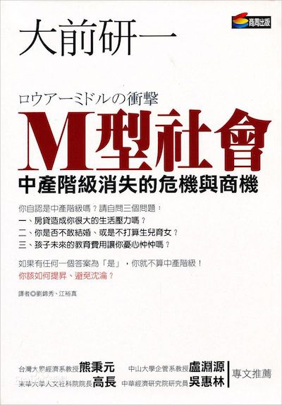

> 加入新的组织，要求每月读一本书，书名是指定的，三月的读书任务是大前研一的《M型社会》。我原本有自己长长的书单，不过这样也好，逼着读一些不在自己视线内的书，也许有意外收获。

  

<!-- more -->

《M型社会》这本书需要结合挺多日本的社会背景，比如人口老龄化、年功序列制度、税金制度、小泉改革、日本政体结构等等，这些和中国的现实差异比较大，因此读起来实在没有太多感觉。每天捏着鼻子读一点，每次读之前耳边总感觉有人在催：“**大郎，该喝药啦……**”。3月最后一天终于读完了，我就说几点让我提起兴趣的吧。

# 关于吃
第三章下 *“不相信自己舌头的日本消费者”* 一节，提及： *“我认为世界上最好吃的牛肉是阿根廷牛肉……”* 不过有点奇怪，接下来需要给出论据的时候却说，作者曾用日本牛、澳大利亚牛和美国牛对日本主妇做过盲测（没阿根廷牛肉啥事儿），其中澳大利亚牛和美国牛又分食草牛和五谷杂粮饲养的牛。盲测结果是澳大利亚五谷杂粮饲养的牛以压倒性的优势胜出。

看到这里，立马操起手机，京东下单，阿根廷牛肉比澳大利亚的还便宜，明天送到！  
牛肉不容易熟，做老了又容易像破布一样嚼不烂。关于牛肉的做法，我还有套绝活。挑肥瘦相间，最好是胸口部位，肉是层层叠叠的，切成条或块。头一天晚上凉水下锅，煮沸后撇去沫，超市买来现成的牛肉汤料下进去，加点糖，小火滚上二十分钟后关火，闷一晚上，第二天早上起来，小火煮沸即可。开锅后的香味能把你馋一跟头，反正我每次都忍不住先来几块。

好多年没有亲自下厨做过红烧牛腩了，明天就可以吃到，算是《M型社会》给我的福祉吧，哈哈哈哈~

关于吃，还有一点让我意外的是，作者说日本进口中国的鳗鱼、朝鲜的玄蛤，放在日本的池塘里游上一个礼拜，再拿出去卖，就可以标明 **原产地：日本** ，类似的还有洋葱、茶叶，以满足日本人的“国产信仰”。原来对吃如此讲究的日本人也这么搞，看来吃还是要追随自己的味蕾，不必过分迷信所谓原产地。

# 关于作者
在读一本书之前我喜欢先了解作者背景以及都写过哪些著作，相互关联是什么。第一次读大前研一是在2015年读《思考的技术》，当时写了份简短的笔记，关于作者给我印象最深刻的是他人生的归零态度和勇气。

《经济学人》曾把大前研一评选为全球五位管理大师之一、日本战略之父，然而大前研一并不是经济管理学科班出身。他本科在早稻田大学学习应用化学，有一次读到一篇关于全球石油资源枯竭的论文时深受震动，于是研究生考入东京工业大学研究所原子核工学系，研究核能。毕业后进入日立核能开发部，梦想制造日本人自己设计的原子炉，第二年就因为公司放弃了这个方向而选择辞职。一次无心插柳的机会，他以“化学工程师”的身份应聘进入麦肯锡，逐步转型为管理顾问。

大前研一谈自己人生的转变时说：自己的人生是自己判断、自己选择的，知道错了，只要立刻归零再做修正就是了……一直悔恨自己的人生而不付诸行动，与固执于错误的假设一样没有意义。

作者的经历和这段总结给我的印象最为深刻，我最为佩服的就是敢于放下存量，勇于追求自己梦想的人。多彩，率真！

# 衍生一则趣闻
在大前研一另一本《低欲望社会》中描述日本社会低欲望的状态，我看到一则趣闻。提到日本，很多人都有一个印象，就是日本人热衷于性爱，所以才拍了那么多情感动作片。但据日本“国立社会保障与人口问题研究所”发表一份调查报告称，日本18到34岁的女性，有39%的人还是处女；而这个年龄段男人“童子身”的比例也高达36%。低欲望不止反映在性的问题上，也反映在各个方面，比如，日本人没有炒房的欲望、没有炒股的欲望、没有结婚、购物的欲望，谈恋爱嫌麻烦，上超市嫌多余，一部手机宅在家里万事不求人……

看来找个日本女人当老婆不一定是多么性福的事儿……