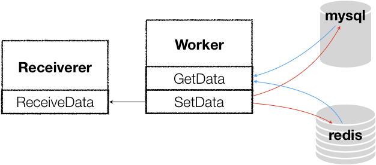
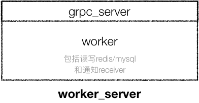
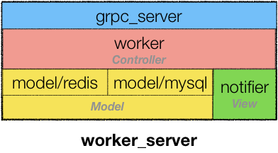

这是最近做微服务时遇到的一次重构，我把业务细节剥离掉，留下模型化的讨论，借这个例子加深对MVC的思想和实现的学习。

<!-- more -->
# 业务逻辑
业务逻辑非常简单：编写一个GRPC服务，两个接口分别用于设置数据和获取数据（稍微做了点简化）：
- SetData(dataType int32, content string) (err error)
- GetData(dataType int32) (content string, err error)

其中SetData(...)需要把数据保存到redis和mysql，并通知另一个GRPC服务数据更新。不妨称本服务为Worker，另一个被通知的服务为Receiver。如下图：


这种模式在具体应用中很常见，比如Worker是用户中心，Receiver是基于用户的应用，比如音乐、视频……当用户在用户中心修改了用户名后，需要通知上层应用刷新（通常采用订阅）。

# 一坨屎版

最初的版本是
[https://github.com/palanceli/MVCSample/pull/2](https://github.com/palanceli/MVCSample/pull/2)
文件结构如下：
``` shell
.
├── README.md
├── config.yml
├── go-fundamental		# 基础模块
├── receiver			# receiver proto协议文件及自动生成的go代码
├── receiver_server		# receiver 端代码，打印收到的数据
├── worker			# worker proto协议文件及自动生成的go代码
│   ├── worker.pb.go
│   └── worker.proto
└── worker_server		# * worker 端代码
    ├── config
    │   └── config.go
    ├── grpc
    │   ├── grpc_server.go	# 实现grpc接口，只是一层转发，到worker
    │   └── grpc_server_test.go
    ├── main.go
    └── worker
        └── worker.go		# * 核心业务逻辑
```
仅标星部分和主题相关。

原先的实现分两层：
- `worker_server/grpc`实现grpc的接口，只做薄薄的转发
- 核心功能放在`worker_server/worker`中来实现




由于grpc本身有一套固定的模式，算是grpc的业务逻辑，这么分层就把grpc和业务分离开了。一旦测试出bug可以比较容易地定位问题出在grpc层还是业务实现层。  

但这么做的问题依然很大：
1. 业务层变动的可能性很大，传说中的需求变更。比如当数据变化时现在是通知一个receiver，也许未来会要求通知多个不同的receiver；有的数据类型要保存redis和mysql，有的可能只需要保存mysql；读数据的时候有的只从redis检索即可，有的可能要去mysql…… 这类变化在日常开发中经常发生。在现有框架下就必须修改worker，这一层做得太厚太重，轻微的扰动很容易改成一锅粥。而且对应的UT也要跟着改。
2. `worker_server/worker`内部本来是能看出不同的层次和模块的，比如 **“当数据变化时，保存数据库并通知receiver”** 属于策略， **“调用redis和mysql完成保存”** 以及 **“调用receiver通知接口”** 则属于机制。如果你是个新手，对于mysql或redis操作还不是很熟，在这么个框架下你就必须把`worker_server/worker`整个逻辑实现完成后才能测试。遇到问题必须先定位属于哪一层、哪个模块。策略和机制绕在一起会增加调试的难度——redis和mysql的鉴权、连接；grpc的连接、调用这些都是在机制层经常遇到问题的点。因此，更好的做法是把这些机制层的实现模块化隔离出来，独立测试确保完全没问题。再装配到策略层，遇到问题就只考虑业务逻辑的实现即可。

# 修改思路
分析一下业务逻辑，这是个挺典型的MVC应用场景：
- M 是redis、mysql存储层
- V 是receiver，当数据变化了要通知该服务，它也许要刷新界面，尽管不在同一个进程甚至主机
- C 是worker的业务逻辑

修改后的代码是[https://github.com/palanceli/MVCSample/pull/3](https://github.com/palanceli/MVCSample/pull/3)  
结构如下，这里把V和C放一起了，但用两个文件隔开：
``` shell
├── config
│   └── config.go
├── grpc
│   ├── grpc_server.go
│   └── grpc_server_test.go
├── main.go
├── model				# M 层 实现存储
│   ├── mysql
│   │   ├── mysql_model_interface.go
│   │   ├── mysql_model_test.go
│   │   └── mysql_store.go
│   ├── redis
│   │   ├── redis_model_interface.go
│   │   ├── redis_model_test.go
│   │   └── redis_store.go
│   └── worker_data.go
└── worker
    ├── notifier.go			# V层 通知receiver
    ├── notifier_test.go
    ├── worker.go			# C 层 实现业务逻辑
    └── worker_test.go
```




这样做的好处是MVC各个模块可以独立测试，稳定后再组装。如果在顶层遇到问题，可以先跑一遍机制层的UT，没问题就可以信任底层，把注意力集中到业务层。遇到业务层的需求变更，也可以把注意力聚焦到该层，该层的任何修改都不会引起底层的变化。

有人问，按照原来的框架，在worker内部把M和V分函数来写不一样是分模块，具有可独立测试的效果吗？
抛开MVC的结构，其实任何设计的目的都是为了简化问题的复杂度，手段只有两个——1、分层；2、分模块。二者结合才能把隔离效果做得更好，一大坨代码堆在worker里，不便于阅读，也给修改代码引入了改错的风险。
