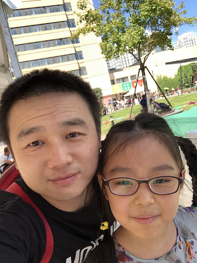
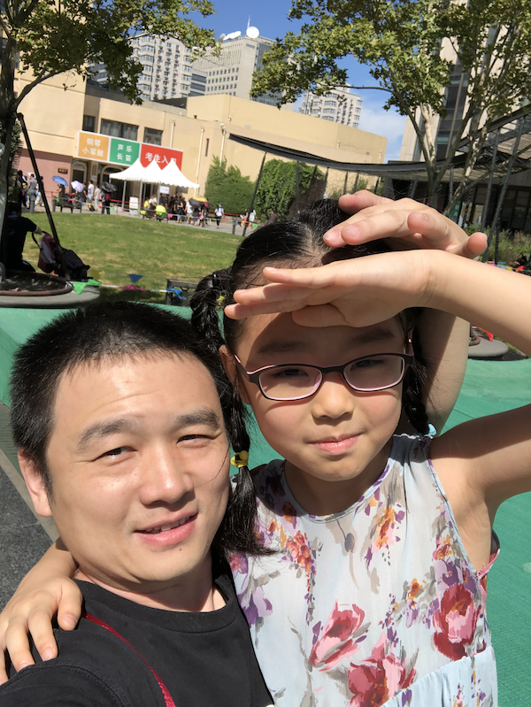

今天收到了女儿钢琴八级通过的消息，非常高兴，这次考级结果公布比较早。一周前我陪女儿去考试，现在还记得一路上女儿有点不安，时不时问我万一没考过怎么办。进入考场也就五分钟就结束了，女儿很高兴地告诉我——很顺利，应该没问题。

到今年学琴已经第五个年头了，其中有挺多的经验、教训值得总结，在此做个梳理吧。

<!-- more -->
# 陪伴是表达关心和重视的最重要的方式
女儿平时放学后练一个小时的琴，周末上午、下午各练一个小时（课外班紧的时候也会调整为1个半小时或1个小时）。刚开始学琴的时候，周末我一定陪她一起练习。我认为这种陪伴非常重要，我的时间也非常宝贵，但既然陪就要陪得有价值，不要玩手机，不要身在曹营心在汉，全心投入到孩子练琴的一个小时里。如果听不懂，可以为她营造一个好的氛围——停止一切可能打扰她的噪音，天气热了为她扇扇子，检查琴凳是否舒服，帮她找一个方便的书夹；如果能跟得上她的进度，还可以帮她翻页，检查指形，纠正练习中的错误；如果音乐感觉更好一些，可以帮她解读乐曲，用更具象的描述帮她理解音乐……总之，陪伴的时候能做的事情很多，一定要把握住一个原则：做对她有价值的事情，而不是低水平的陪或者监督。在我的影响下，女儿每天练琴的时间，全家都会自觉进入“静音”模式，妈妈在这段时间不使用吸尘器，老人不在客厅里聊天、看电视，孩子其实很敏感，透过很多细节她能感受到家长的重视。我自己只在十年前学过不到两年的钢琴，没考过级，可是现在依然能指导孩子练琴，这也需要我不断地学习、观察和思考，逐步培养起和孩子之间的信任，并且探索还能为孩子提供什么帮助。

# 陪伴是分层次的
女儿四岁多开始学琴，我觉得自己幸运之处在于孩子刚开始学习的时候并不排斥。我压箱底的视频里有一部是久石让的音乐会，舞台背景是一块巨大的银幕，随着每一段音乐播放对应的动画片，整场音乐会非常生动，很适合小孩子看。女儿两三岁的时候我就和她一起看，看得入神。稍大一些给她玩我的电钢琴，坦白讲我觉得琴这个东西很难让完全没有背景的人产生乐趣，交互性虽然很强，但很难掌握章法，对于初学者几乎不肯能够让这个键盘产生出美妙的旋律，所以最初的引导常常适可而止——我担心她接触太多会明白这个玩意儿多么不听话。

四岁的饿时候幼儿园开设钢琴课，有专门的老师一对一教琴，孩子是一张白纸，那么小很难知道自己是不是喜欢，我觉得只要不排斥，就尽可能让她接触到不同的事物。
“愿意学习钢琴吗？”
“愿意”
“那我给你报钢琴班吧？”
“好”
“中间可能会遇到很多困难哦，但既然报了，中途是不能退出的，至少要坚持完一个学期。当然，如果你学好了，老师会表扬你，你会比班里的同学更受老师喜欢”
“好”
我们学琴就是这么开始的。

然而毕竟只是个四岁多的孩子，最初的一个学期有点痛苦，我认为这段时间是家长最需要发挥作用的关键时期，而且其实并不需要家长具备太多专业知识。学琴最初的困难是识谱，最大的挑战是坚持。

我把识谱需要的知识分散到生活的点滴当中，尽量在玩耍、休息的时候还能帮她巩固识谱能力，比如：幼儿园的孩子通常都有老师梦，我在家里买了块很大的白板，满足她当老师的愿望，每天在写写画画的过程中常常画一段五线谱，随便点个位置问她是什么音；我在pad里下了很多练习识谱的游戏，我和她一起玩，一起比赛，看谁的得分更高。孩子的反应和记忆速度其实很厉害，要不了多久，她就能超过大人。慢慢地，女儿喜欢自己在黑板上画五线谱，常常考考家长。我给她买了一摞五线谱的练习本，她常常在上面写写画画，要自己作曲了。通过这种不知不觉的练习，女儿在起跑线上很快就把其他同学远远地甩到后面，一方面为她梳理了成就感，另一方面也为后面的学习打下非常坚实的基础，识谱顺畅了，以后学习练习曲能减少一半的难度。

怎么帮助她坚持呢？首先识谱帮她减低了学习的难度，提升成就感，自然就减少了坚持下去的痛苦程度，这是个此消彼长的过程。但即便如此，最初也常常有流眼泪的时候，我也发生过几次情绪失控，合上琴让她别学了。然而处理任何事儿，情绪失控都是大忌，冷静下来还是要找方法。我从淘宝买了两枚印章，一个哭脸，一个笑脸。每个月给她打印一张月度练琴记录表，每天练完一个小时，就在表格上盖一个笑脸，没练完就盖一个哭脸。我告诉她这是幼儿园老师给家长布置的作业，本来是家长负责盖章，我交给她自己盖（其实是因为工作日，我到家她就睡了，没时间检查）。到了月底，家长会要把这张表格交给老师。幼儿园的孩子最听老师的话，也最怕老师。这一招祭出非常奏效，后来我把生活中的一些坏毛病也和这张表格绑在一起。有段时间女儿会冲人吐口水，这是绝对禁止的，有一次因为这事儿我给她盖了个哭脸，她哭了一晚上，后来就改掉了这个坏毛病。但是我想说的是：这种约束的手段尽量少用，尤其不要因为所谓“不听话”而动用这种惩罚方式，因为我觉得孩子调皮一点不算什么大毛病，只要没有什么原则性错误，尽量不要束缚她。

到了月底，对着一个盖满笑脸的表格，要记得“转述”老师的表扬，孩子需要持续的刺激和激励。

我觉得让她慢慢喜欢和坚持学琴，更重要的还是激发她自己的成就感，其中的要害还是能帮她降低学习的难度，比同龄的同学学得快、弹得好，自然就有成就感。多让她参加各种钢琴比赛，虽然有的比赛很水，大家在一个场子里表演，优劣是一目了然的，舞台又放大了这种效应，给孩子的刺激是非常直接的。还有什么降低学习难度的方法呢？这就进入第二个陪伴的层次。

# 让她明白做任何事都是有方法的
解决了识谱的问题，要想顺利完成每周的练习曲作业，下一步就是指法。一首曲子如果你每次练习都采用不同的指法，就相当于每种指法只练习了一次，那就完全起不到练习的作用，这是最初的琴童最容易犯的错误。她不是有意要变换指法，只是曲子还不熟，记不住上次指法是什么。于是我给雨点的第一个方法是：每次学了新的练习曲，第一件事是把指法标注一遍。最初我会和她一起标注，推断出最合理的指法，其实就是最舒服的指法，慢慢地我让她自己做，我会检查一遍。很快她就能独立完成指法标注了。第二个方法自然就是：每周第一天的练习一定不要追求速度，而要追求指法固定。有了这两个方法，保证孩子没有无效练习。我告诉她的第三个方法是：分节练习，每周前三天不要弹整段的曲子，分一小节一小节的练，一个小节做到连弹三遍不出错，再往下走。这个方法是继续帮助她聚焦，提升练习的效率。我告诉她的第四个方法就需要我多上心了：每次学了新的曲目，在练习之前一定要先听，这要求我找到教材里的所有曲目的音频文件，事先给他考到pad
里，而且我找了一个可变速的app，一首比较陌生的曲子，最好先慢速听。开一个熟悉的曲子，不管是心理上还是实际操作，难度都大大降低，而且不会再犯大错误，因为弹出来的旋律不对，她自己就能分辨出来。

以上就是在5级之前我给雨点的四个方法。不过她常常会忘，我就在钢琴上贴一个纸条，用大字写下这四个方法，每天练琴之前先读一遍，形成习惯也需要漫长的过程，家长要有点耐心。

其实以上都不需要家长具备多少专业知识，只要用心都能做到。家长要思考的只有一个问题：我能帮助孩子做什么她做不了的事情，而不只是监督、盯着做事儿。和孩子一起把方法沉淀下来，这些就是孩子可叠加的进步，形成习惯之后，就不用家长再持续操心了。

当然你为孩子总结的方法，要让她觉得有效果，真得能解决她的问题。比如，当她遇到比较难的曲子时，一直过不去，我就帮她把段落拆得更小，降慢速度，帮她分析左右手的时序关系，给她打着拍子让她练习，直到练熟了。通过这种陪伴，能建立孩子对你的信任感。有朋友跟我抱怨：我在教孩子的时候，他常常不听我的，说老师就不是这么教的，非要和我反着来。我觉得首先要让孩子感受到你的关心和陪伴，而不是挑刺和指错，要在她最困难的时候，果断出手，帮她渡过难关。

# 建立对方法的信仰
这一步是对方法论的进一步抽象，让她知道做任何事都有方法，要不断沉淀适合自己的方法。

有一个类比给我的启发很大，说在不会下棋的人眼中，棋局就是一堆木头块移来移去，你可能看上几天也不明白其中的章法，但如果你了解了规则，只需要几分钟就能跃跃欲试地跟人对峙了——这就是方法的力量。我希望让孩子明白，之所以觉得难，只是因为你或者我都还没有找到更好的方法。在顶尖高手的眼里，这点困难都不是事儿，要不断琢磨更适合自己的解决问题的方法。

我鼓励孩子学琴的目的有三：1、最重要的是让她在精通一门手艺的过程中，积累自己的学习方法。2、让她体会到和时间做朋友的方法和好处，让时间帮助自己逐步精进高筑起一项优势，直至万仞。3、培养审美力。至于要不要成为自己未来的专业，那不是我考虑的事儿，等她长大了由她自己选择吧，我倒希望最好不是专业~

在孩子学习其他事情的时候，我常常拿学琴和她做类比。记得小学一年级的时候，体育课要考试跳绳，女儿完全不会，回到家里开始发脾气，不高兴。周末我抽一个下午，跟她一起分析学习方法。我把跳绳的动作不断分解，从连跳分解出跳一个，再从跳一个分解出挥臂、起跳、再挥臂，并且从节奏、时机帮她分析每个动作的起始点和衔接。十几次的练习就让她学会了跳绳。等学会之后，我再和她复盘——动作的分解就好像练琴的时候我让她分节、分段练习，每次只关注一个动作要点和练琴时每节、每段反复练习直至熟练也是一个道理，核心都是集中力量定点突破。二年级她学习数独，感觉很吃力，我就和她一起总结方法，我给她总结出五条规则，应对各种数独图形，可以应对所有的数独题目。等等这些通过一件件的小事让她体会到做任何事情都要先思考方法，而不要上来就蛮干，甚至建立起对方法的信仰。

我在辅导她功课的时候不太在意她做题的结果怎么样，但很在意过程，因为过程即方法。只要方法正确，成功的概率就会很高。我教她做数学题的时候放草稿纸的位置，教她在草稿纸上演算的方法、书写习惯，教她复查的方法。在她大一些的时候，问她自己有没有积累好用的窍门、方法。这么做的好处就是，一旦她掌握了方法，并且形成习惯，以后家长就可以少投入一些精力，这才是可叠加的成长。

# 再聊音乐
音乐不是八分音符、十六分音符，也不是乐曲有多长、多复杂。每一个音符都只是一种色彩，音乐是用这些色彩组织成的万紫千红。而且音乐的魅力在于每一个人都可以用自己的方式去体会、理解它。因此我会教女儿怎么体会一段音乐。在她学习跳音的时候，我买了个皮球，跟她一起体会什么是笨重的跳音，什么是轻盈的跳音。她在很小的时候就会拍球，用球来类比手腕的发力方式，对她来说更容易理解。有的乐段像过山车一样，刚开始慢慢地爬升，到了最顶端一下子滑下来；有的乐段像连绵不断的阵雨，一波接着一波。《伏尔塔瓦河》就像坐着热气球，从消息的发源地，一点一点看它汇集四处的雪水，最终成为大江大河，穿过田野、穿过小镇、穿过猎场，生机勃勃；《夜曲》就像宁静的夜晚，喝至微醺从小酒馆里出来，蹒跚着步伐，扶着路边昏黄的街灯，时而舞上几步，时而对着月光凝视片刻；八级的一首曲子，有一小段是左右手相互起伏，我给她看《猫和老鼠》的一些片段，让她联想自己的两只手就是在表演猫和老鼠此起彼伏疯狂追逐的场面……通过这些类比，让她学会在脑子里构建对音乐的想象。有时候我会和她一起听着音乐，问她“你想到了什么？”

# 是音乐把女儿重新交给了我
对我来说，陪女儿学琴有个最以外的收获，就是重新构建了父亲和女儿的亲子关系。女儿三岁前，跟我很不亲。一方面是我在那几年工作遇到了挑战，实在太忙了；另一方面也是因为我其实还没做好当父亲的准备，太不成熟。常常对孩子没有耐心，发脾气，也动过手。因此雨点小时候是极度不愿意和我在一起的，每次过马路我去牵她的手，都被她挣脱，我的内心非常悲凉。

转折就是从学琴开始，她发现我能教她学得更轻松，逐步对我有了信任，遇到问题开始愿意向我求助，我常常和她一起讨论学琴的体会，问她烦不烦，愿不愿意继续，她也慢慢和我聊一些感受。至今还记得有一天出去玩，她愿意主动牵我的手了，内心里那个激动。

我也很珍惜在亲子关系上取得的成果，四岁以后再也没打过她。想和她找点话题聊的时候，常常就从最近学琴开始。也有练习不上心明显下滑的时候，我对她的严格要求她还是能听得懂，只要你能明确说出来问题是什么，应该怎么改，她就会照着做。这是雨点的优点，应该也算是我的幸运吧。

